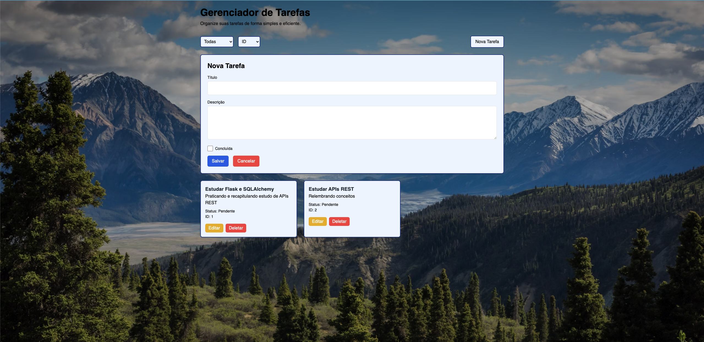
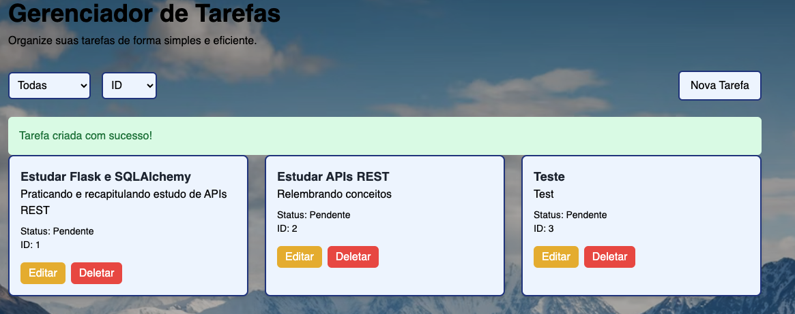
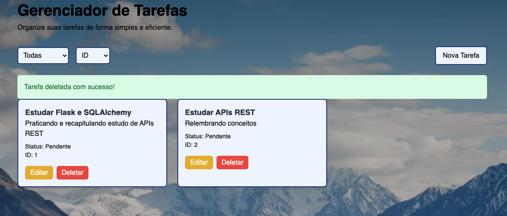

# Gerenciador de Tarefas

O **Gerenciador de Tarefas** é uma API REST desenvolvida com Flask, acompanhada de uma aplicação web para gerenciamento de tarefas, checklists interativas e uma interface moderna. A interface web permite interagir com a API de forma amigável, eliminando a necessidade de ferramentas como o Postman para adicionar, editar ou visualizar tarefas.

## Descrição

A API fornece endpoints para operações CRUD (criar, ler, atualizar, deletar) de tarefas com checklists associadas. A aplicação web consome esses endpoints, oferecendo uma interface responsiva para gerenciar tarefas sem interação manual via Postman. O projeto está em fase inicial de desenvolvimento. Ele utiliza SQLite localmente e está preparado para futura migração para PostgreSQL em produção.

### Funcionalidades
- **Tarefas:**
  - Criar, editar, deletar e listar tarefas, cada uma com título, descrição e status de conclusão.
  - Checklists interativas por tarefa, permitindo adicionar e marcar itens como concluídos.
  - Filtros por status (todas, concluídas, pendentes) e ordenação por título ou ID.
- **Interface:**
  - Design responsivo com Tailwind CSS (via CDN).
  - Mensagens de erro e sucesso estilizadas (ex.: fundo verde para login bem-sucedido).

## Tecnologias
- **Backend:** Flask, Flask-SQLAlchemy, Flask-Cors, bcrypt
- **Frontend:** HTML, Tailwind CSS (via CDN), JavaScript
- **Banco de Dados:** SQLite (usado localmente)
- **Controle de Versão:** Git, GitHub
- **Ferramentas:** Python 3.8+, pip, VS Code

## Demonstração

A aplicação web consome a API REST para gerenciar tarefas, substituindo a necessidade de ferramentas como o Postman. Abaixo estão capturas de tela das principais funcionalidades, rodando localmente em `http://localhost:5000`:

*Lista de tarefas com filtros, consumindo o endpoint `/tarefas`.*

*Adicionando uma nova tarefa ao endpoint `/tarefas`.*

*Mensagem de sucesso após operação na API (ex.: criação de tarefa).*

*Mensagem de sucesso após operação de deletar uma tarefa na API (ex.: deletando uma tarefa).*
